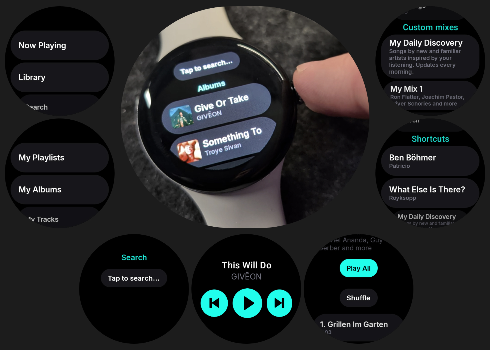

# Tides: Unofficial Tidal for Wear OS

An unofficial Tidal client for Wear OS, built with Kotlin and Jetpack Compose.

> **Disclaimer:** This project is not affiliated with, endorsed by, or connected to TIDAL, Block Inc., or any of their subsidiaries. "Tidal" is a trademark of Block Inc. This app requires an active Tidal subscription. Use at your own risk.

## Screenshots



## Demo

https://github.com/user-attachments/assets/7adf29ef-2327-40ef-b461-9463c7a94e71


## Why I Built This

Tidal users are canceling their subscriptions over Tidal not supporting WearOS. 
Every major music streaming service like Spotify, YouTube Music, Deezer, Amazon Music, SoundCloud has a native Wear OS app. 
Tidal doesn't so I built one.
The demand has gone unanswered for over 4 years across Samsung Community forums, Reddit, and feature request boards. 

Meanwhile Tidal already has an Apple Watch app that does all of this. Standalone streaming, offline downloads, media sessions, it's all already working on their side.

The affected user base is estimated to 250k–500k users. People who bought LTE Galaxy Watches or Pixel Watches specifically to go phone free during workouts, runs, and commutes. 

I personally LOVE running with no smartphone and nothing on me except my watch. And I'm quite sure I'm not the only one.

<details>
<summary>Market research</summary>

- Wear OS holds ~27% global smartwatch OS market share (2024), up 6 points YoY - the only major platform gaining share
- 60–100 million active Wear OS devices worldwide as of 2025
- Tidal has had an Apple Watch app for years, so the hard stuff is already solved in their codebase. ([What Hi-Fi?](https://www.whathifi.com/news/new-tidal-apple-watch-app-works-without-an-iphone))
- Tidal abandoned its Samsung Tizen wearable app when Samsung moved to Wear OS in 2021 and never followed. ([Grammy.com, 2018](https://www.grammy.com/news/listen-your-watch-tidal-app-now-compatible-samsung-wearables))
- Forum post: ["Just canceled Tidal. Not available on WearOS."](https://www.tigerdroppings.com/rant/tech/just-canceled-tidal-not-available-on-wearos/107803524/)
- Samsung Community: ["Galaxy Watch 4 Classic LTE no Tidal support!?"](https://eu.community.samsung.com/t5/wearables/samsung-galaxy-watch-4-classic-lte-no-tidal-support/td-p/3947258)
- Samsung Community: ["TIDAL Support to Samsung Devices in 2025!"](https://eu.community.samsung.com/t5/audio-video/tidal-support-to-samsung-devices-in-2025/td-p/11073296)
- [AlternativeTo lists Tidal as absent on Android Wear](https://alternativeto.net/software/tidal/?platform=android-wear), redirecting users to competitors

</details>

## Features

- Browse your Tidal library (albums, playlists, mixes)
- Stream music directly on your Wear OS watch
- Download albums and playlists for offline playback
- Listen without Wi-Fi or phone connection
- Manage downloads and storage from the library
- Now Playing controls with track info and artwork
- Search for tracks, albums, and playlists
- Device Code authentication flow

## Setup

1. Clone the repository
2. Copy `gradle.properties.example` to `gradle.properties`
3. Fill in your Tidal API credentials (client ID and secret)
4. Build and install:
   ```bash
   ./gradlew assembleDebug
   ```

## Architecture

The project follows Clean Architecture with MVI pattern, organized into 7 Gradle modules:

| Module | Description |
|--------|-------------|
| `app` | Main application, navigation, DI |
| `core` | Shared UI theme, networking, data stores |
| `feature-auth` | Device Code authentication flow |
| `feature-player` | Audio playback with DASH manifest support |
| `feature-library` | Library browsing (albums, playlists, mixes) |
| `feature-download` | Offline downloads, storage management, background sync |
| `feature-settings` | User settings and preferences |

**Key technologies:** Kotlin 2.3, Jetpack Compose for Wear OS, Hilt, Retrofit, Media3, Room, WorkManager, DataStore

## Contributing

See [CONTRIBUTING.md](CONTRIBUTING.md) for development setup and contribution guidelines.

## License

This project is licensed under the GNU General Public License v3.0 — see the [LICENSE](LICENSE) file for details.

[](https://www.gnu.org/licenses/gpl-3.0)
